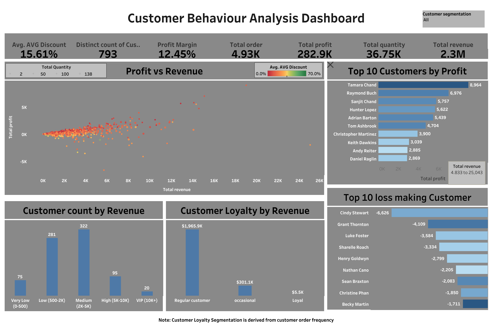
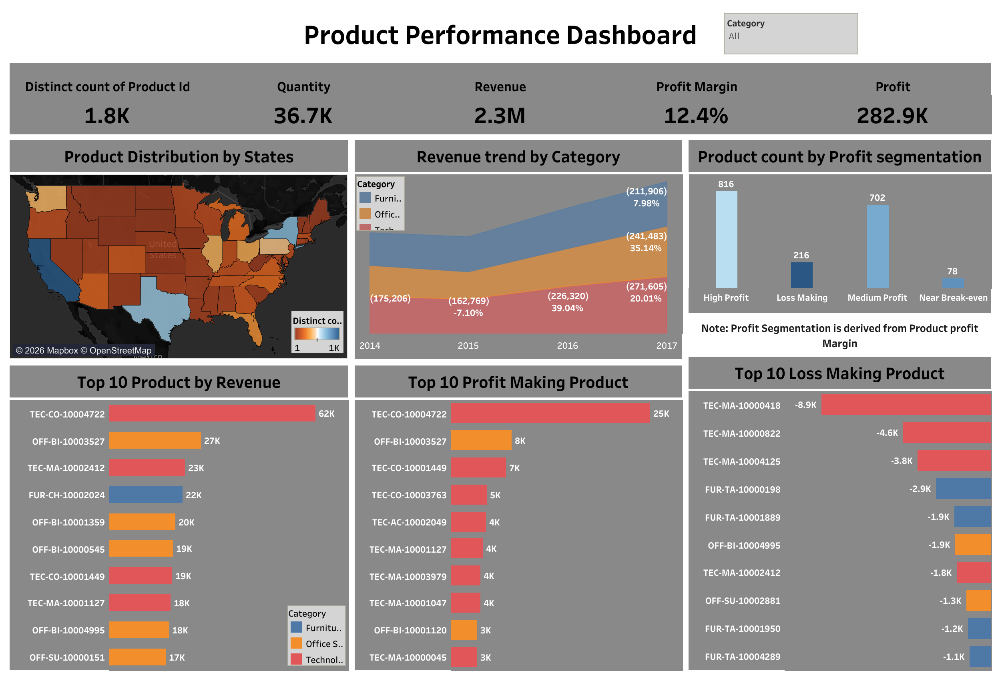
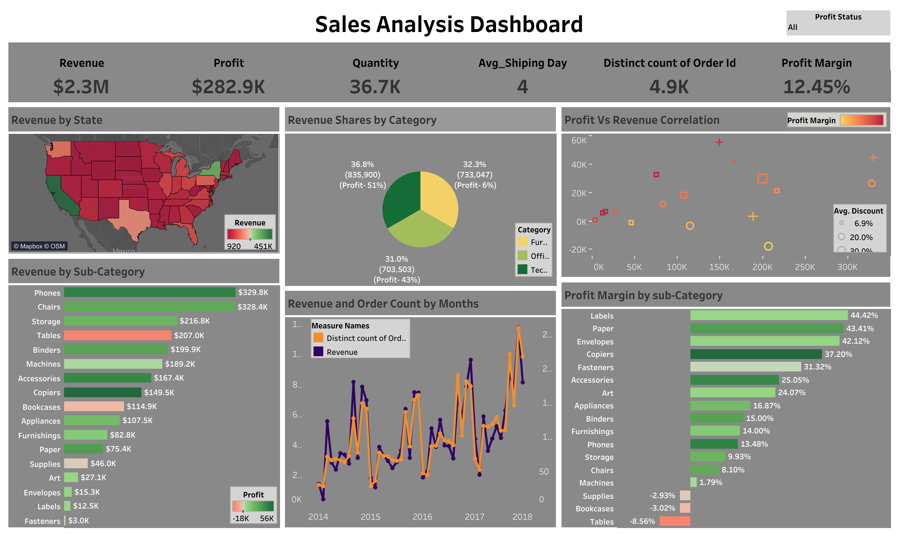
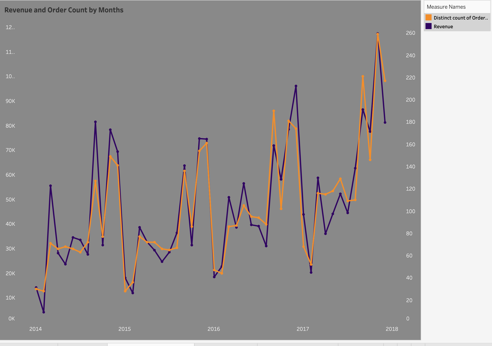
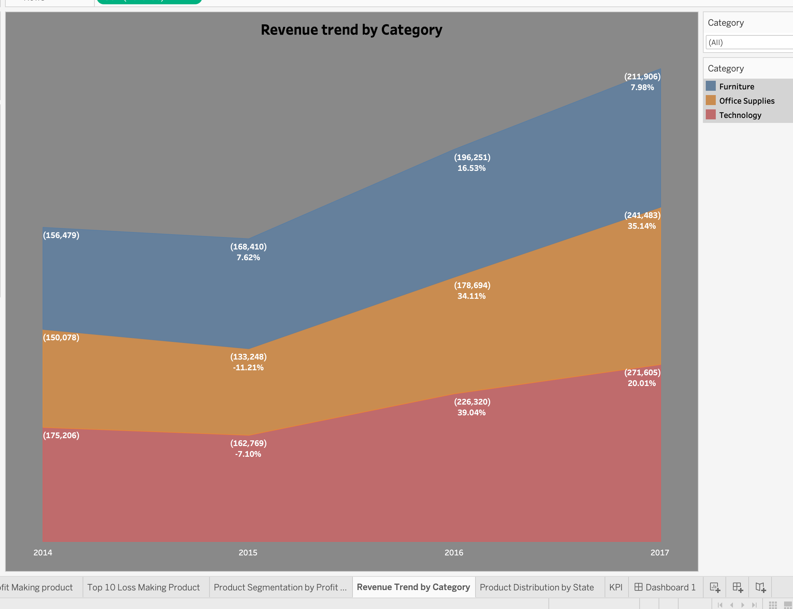
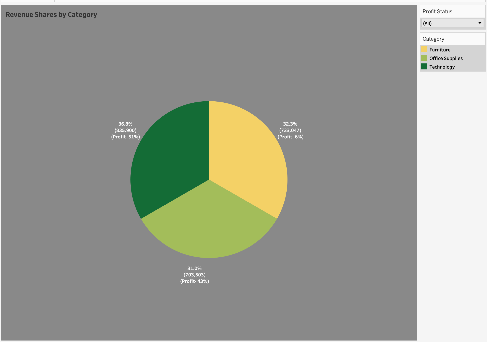
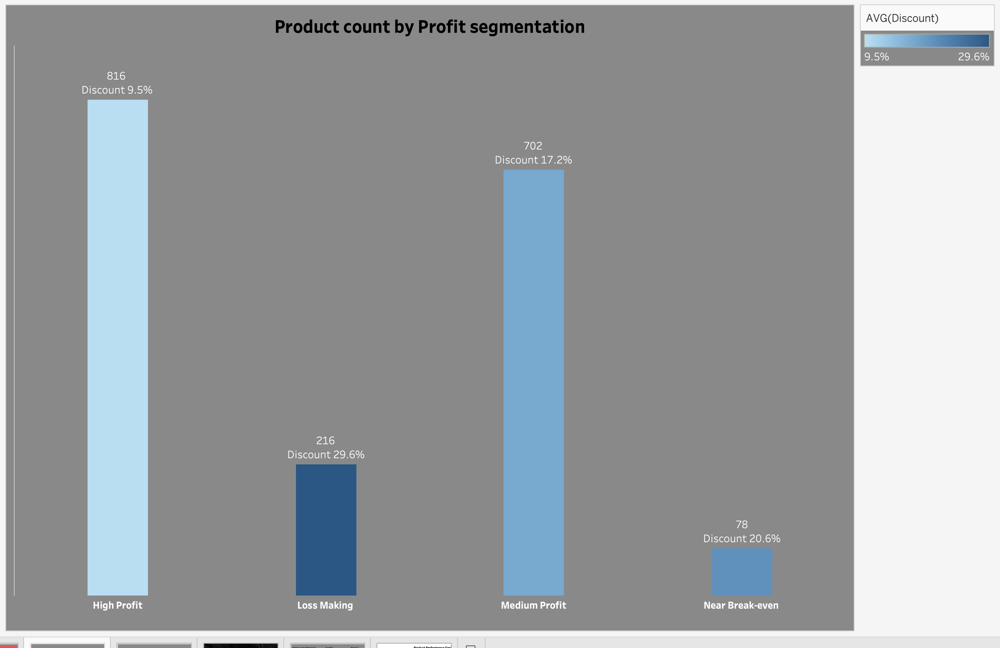
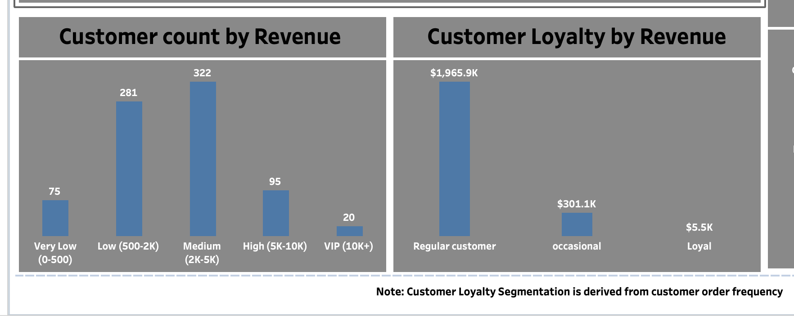
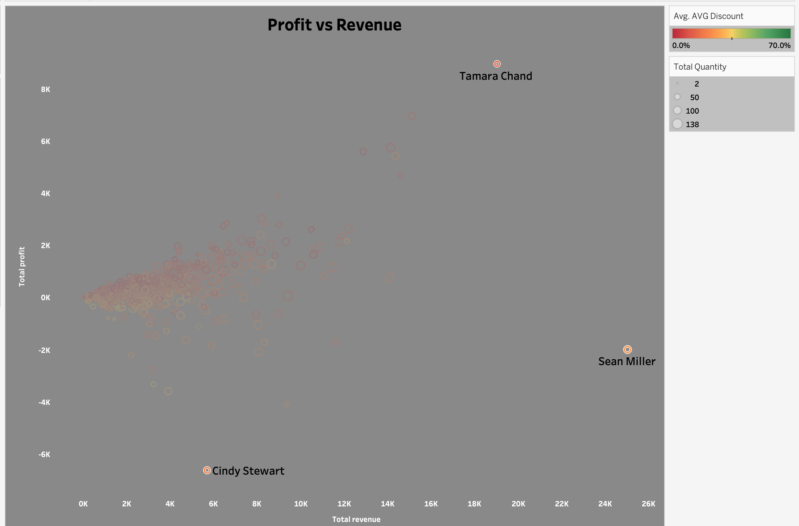
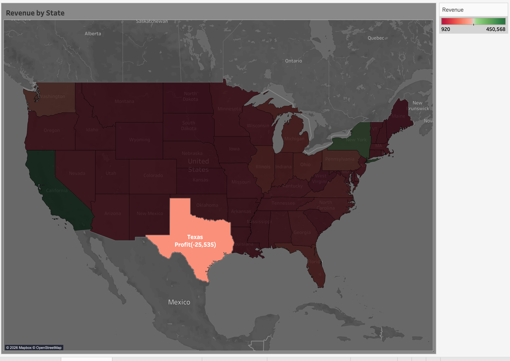

# Superstore Business Performance Analysis

## Project Overview

This project analyzes the performance of a retail superstore business from multiple perspectives, including sales performance, customer behavior, and product profitability.

The objective of this project was to transform raw transactional sales data into actionable business insights that support strategic decision-making across Sales, Marketing, Product Management, Pricing, and Business Development functions.

The project combines data cleaning, SQL-based data preparation, and interactive Tableau dashboards to explore revenue trends, customer segments, profitability drivers, product performance, and regional business performance.

---

## Business Objectives

The primary objective of this analysis was to evaluate overall business performance and identify opportunities for growth and improvement by answering the following business questions:

- Which product categories contribute the most revenue and profit?
- How do customer segments differ in spending and profitability?
- Are discounts affecting profitability?
- Which customers generate the highest value and which generate losses?
- Which markets perform well and which require further investigation?
- What business trends and seasonal patterns exist over time?

---

## Data Source

**Dataset:** Superstore Sales Dataset

**Source:** Kaggle Superstore Dataset

---

## Data Preparation & Cleaning

The raw dataset was cleaned and transformed using Microsoft Excel Power Query before being imported into MySQL.

---

## Data Import Note

During MySQL import, approximately 300 records could not be loaded due to character encoding issues. After validation, the affected records represented a very small proportion of the overall dataset and did not materially impact the analytical findings.

All subsequent SQL transformations, Tableau dashboards, insights, and recommendations were built from the same consistent dataset to ensure analytical consistency throughout the project.

### Dataset

- Superstore_table.csv

---

## Data Modeling & SQL Analysis

After cleaning, the data was loaded into MySQL where SQL was used to create analysis-ready datasets.

### SQL Script

- `Superstore_dataanalysis.sql`

Three analytical datasets were developed:

### Data Files

- `Customer_Dashboard.csv`
- `Sales_dashboard.csv`
- `product_dashboard.csv`

### 1. Customer Behavior Analysis
### Tableau Dashboard

- CustomerBehaviourAnalysis_dashboard.twbx

### 2. Product Performance Analysis
### Tableau Dashboard

- productPerformance_Dashboard.twbx
  

### 3. Sales Performance Analysis
### Tableau Dashboard

- SalesAnalysis_dashboard.twbx

---

## Key Insights

### Revenue & Growth

1. Revenue and order volume exhibit an overall upward trend, while recurring peaks toward the end of several years suggest the presence of seasonal demand patterns.

3. Revenue contracted sharply in 2015, with Office Supplies and Technology experiencing the largest declines. Performance rebounded strongly across all categories in 2016, with both categories returning to positive year-over-year growth.

4. Technology remained the primary growth engine and generated the highest total revenue among all categories in 2017, yet it also experienced decelerated year-over-year growth compared to its strong 2016 rebound.

### Product Performance

4. Furniture contributes approximately 32% of total revenue but only 6% of total profit, indicating substantially lower profitability than other categories.

6. Most products are profitable, but 216 products (11.92% of all products) are classified as loss-making. These products exhibit the highest average discount levels (29.6%), suggesting discounting may contribute to margin erosion.

s
### Customer Analysis

6. Customer segmentation analysis shows that approximately 74% of customers belong to the Regular segment, while VIP customers represent a small portion of the customer base but contribute the highest spending and profit margins.

7. Customer profitability varies significantly across the customer base. Tamara Chand generated approximately $8.9K profit while also ranking among the highest-revenue customers, making her one of the most valuable customers.

8. In contrast, Cindy Stewart generated approximately $5K revenue but produced the largest customer loss. Sean Miller generated the highest customer revenue (~$25K) yet remained unprofitable, demonstrating that high revenue does not necessarily translate into profitability.

### Profitability Analysis

9. Scatter plot analysis suggests customers receiving higher discounts tend to exhibit lower profitability and are more frequently associated with loss-making transactions, while highly profitable customers are generally associated with lower discount levels.

### Geographic Analysis

10. Despite being one of the largest markets by revenue, customer base, and order volume, Texas operates at a loss, suggesting that high sales activity is not translating into profitability.

---

## Business Recommendations

### Product Strategy

1. Conduct a profitability review of Furniture sub-categories and product lines to identify areas where revenue growth is not translating into profit.

2. Explore opportunities to expand higher-margin furniture products and complementary offerings that can improve overall category profitability.

3. Expand and strengthen high-performing Technology product lines.

### Marketing Strategy

4. Marketing should evaluate year-end sales drivers to determine whether recurring seasonal demand can be leveraged through targeted campaigns, inventory planning, and promotional activities.

5. Consider aligning future marketing investments with historically strong demand periods.

### Pricing & Profitability Strategy

6. Sales and Pricing teams should review discounting practices across customer and product segments to assess whether increased sales volume adequately compensates for reduced margins.

7. Establish regular profitability monitoring alongside revenue performance when evaluating promotional effectiveness.

8. Review pricing and discount strategies for loss-making products to determine whether current sales practices are sustainable.

### Customer Strategy

9. Explore loyalty programs and personalized engagement strategies that encourage progression into higher-value customer segments such as Regular and Loyal customers.

10. Analyze characteristics of VIP customers to identify opportunities for acquiring similar customer profiles.

11. Prioritize retention through targeted communication, loyalty incentives, and personalized offers.

### Regional Strategy

12. Regional Sales and Business Development teams should conduct a market-level profitability assessment in markets such as Texas to identify factors contributing to losses despite strong commercial activity.

---

## Tools Used

- Microsoft Excel Power Query
- MySQL
- Tableau
- GitHub

---

## Conclusion

This project demonstrates an end-to-end business analytics workflow, beginning with raw transactional data and progressing through data cleaning, SQL transformation, dashboard development, visualization, and business insight generation.

The analysis revealed that revenue growth alone does not guarantee profitability. Factors such as discounting practices, product mix, customer behavior, and regional performance all play important roles in overall business success.

The findings and recommendations provide a foundation for further investigation and support data-driven decision-making across multiple business functions.
